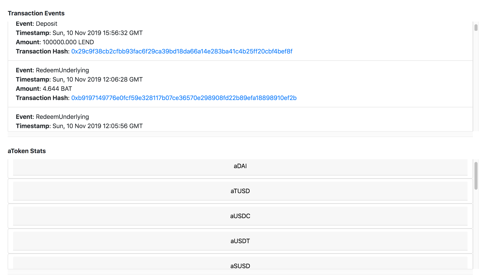

## Aave Analytics
Analytics for Aave Decentralized lending protocol

## App URL


## Screenshots

### Main Stats


### Transaction Events


### aToken Stats


## Getting Started

1) Clone Repo

    ```
    git clone https://github.com/viraja1/aave_analytics.git
    ```

2) Change directory
    
   ```
   cd aave_analytics
   ```

3) Install Dependencies
   
   ```
   npm install
   ```

4) Start Client

   ```
   npm start 
   ```
   
5) Open client app url in chrome

   ```
   http://localhost:8080
   ```
